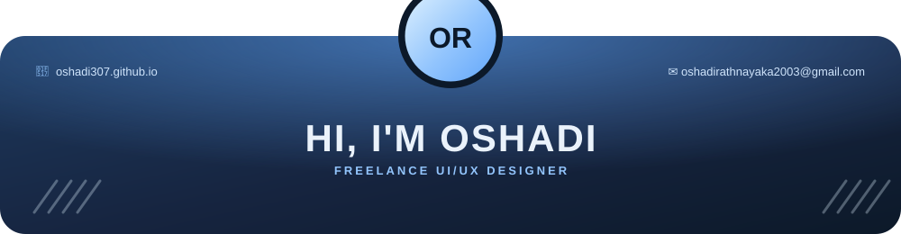
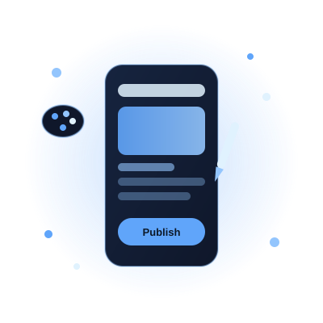

 

<table>
<tr>
<td width="62%" valign="top">

### 🎨 I'M OSHADI!

*Freelance UI/UX Designer &amp; Business Analyst*

I'm a freelance UI/UX designer and Software Engineering undergraduate with a love for turning ideas into
simple, practical digital products. I've delivered 11 projects so far — restaurant &amp; retail systems, mobile
apps, and event booking sites — and I'm currently designing my 12th as a UI/UX Design Intern at Ever Efficient
Business Management.

- 🎓 BSc (Hons) Computer Science with AI @ NIBM
- 🖌️ 11 projects delivered, spanning web, mobile &amp; system design
- 🧩 Currently designing a new project during my internship at EEBM
- 🧠 Comfortable across the full flow: research, wireframes, Figma prototypes, and build
- 💌 Open to freelance UI/UX work — reach out any time
- 💻 Visit my [Portfolio](#) for full case studies

</td>
<td width="38%" align="center" valign="middle">

</td>
</tr>
</table>

 

## Design Toolkit

 

## Tech Stack

 

## Featured Work

11 projects completed across UI/UX design, web, and mobile — a few highlights below. Full case studies are on
my portfolio.

| Project | Type |
|---|---|
| La Pangea Café & Restaurant | UI/UX Design |
| EEBM Event Booking Website | UI/UX + Web Design |
| Personal Finance Mobile App | UI/UX + Mobile |
| HR & Payroll Management System | System Design |
| Supermarket POS System | System Design |
| **EEBM Internship Project** | UI/UX Design — *in progress* |

 

## GitHub Analytics

 

## Let's Create Something Together

  

<i>Open to freelance UI/UX work and new collaborations.</i>

